# **CODING INTERVIEW PREPARATION**

<!-- 🟢🟠🔴 ♻️	🔜	⏭️	❌🔄 -->

## Solved Problems
| Status | Level  | Problem | Solution Preview | Approach (Language) |
| ------ | ------ | ------- | ---------------- | ------------------- |
| ✅     | Easy   | [1. Two Sum](https://leetcode.com/problems/two-sum/) | 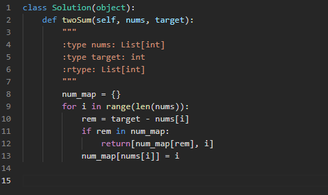 | Array (Python) |
| ✅     | Easy   | [2. Concatenation of Array](https://leetcode.com/problems/concatenation-of-array/) | 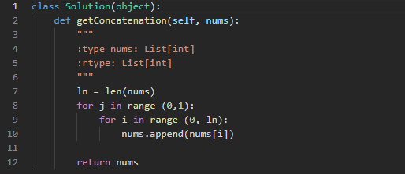 | Array (Python) |
| ✅     | Easy   | [3. Reverse String](https://leetcode.com/problems/reverse-string/) | 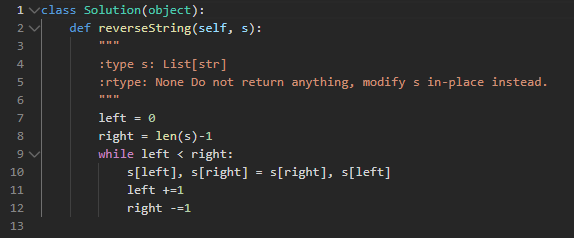 | String Manipulation (Python) |
| ✅     | Easy   | [4. Contains Duplicate](https://leetcode.com/problems/contains-duplicate/) | 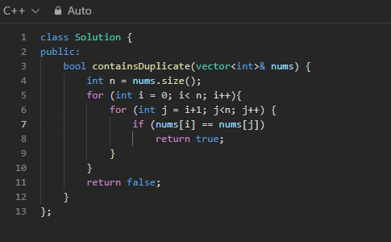 | Hash Table (C++) |
| ✅     | Easy   | [5. Valid Palindrome](https://leetcode.com/problems/valid-palindrome/) | 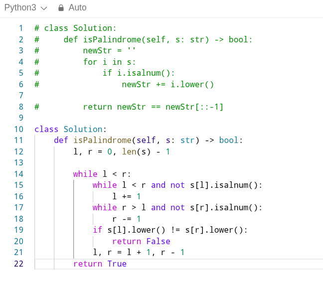 | Two Pointers (Python) |
| ✅     | Easy   | [6. Best Time to Buy and Sell Stock](https://leetcode.com/problems/best-time-to-buy-and-sell-stock/) |  | Dynamic Programming (Python) |
| ✅     | Easy   | [7. Valid Parentheses](https://leetcode.com/problems/valid-parentheses/) | 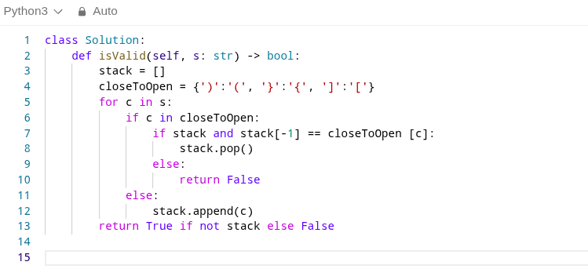 | Stack (Python) |
| ✅     | Easy   | [8. Binary Search](https://leetcode.com/problems/binary-search/) | 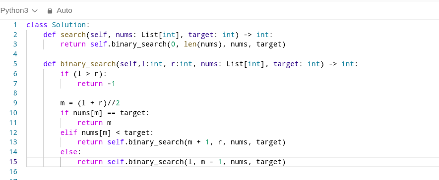 | Binary Search (Python) |
| ✅     | Easy   | [9. Reverse Linked List](https://leetcode.com/problems/reverse-linked-list/) | 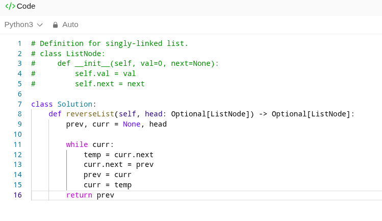 | Linked List (Python) |
| ✅     | Easy   | [10. Invert Binary Tree](https://leetcode.com/problems/invert-binary-tree/) | 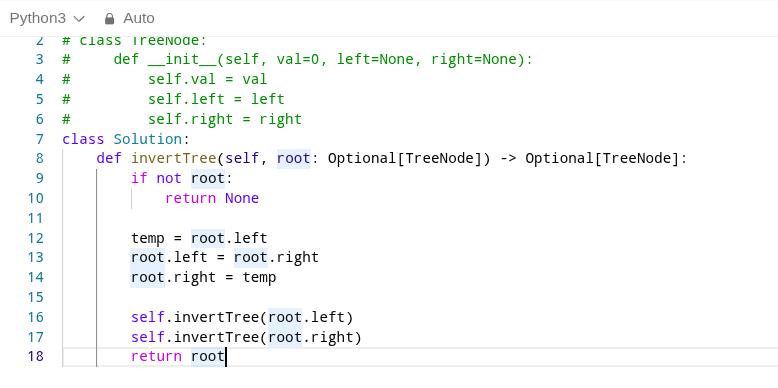 | Binary Tree (Python) |
| ✅     | Medium | [11. Top K Frequent Elements](https://leetcode.com/problems/top-k-frequent-elements/) | 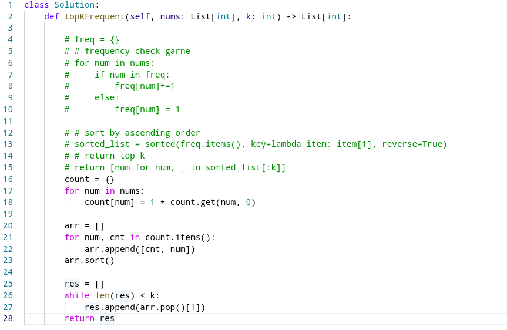 | Heap/Hash Table (Python) |
| ✅     | Medium | [12. Two Sum II - Input Array Is Sorted](https://leetcode.com/problems/two-sum-ii-input-array-is-sorted/) | 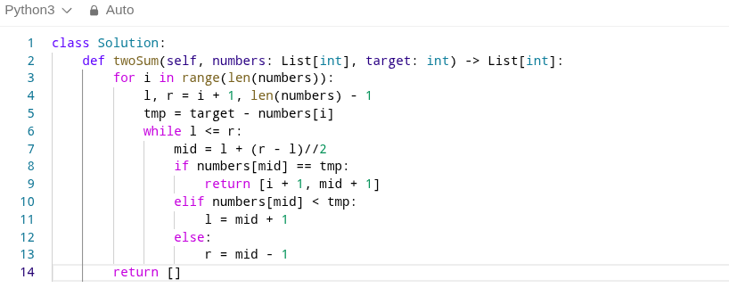 | Binary Search (Python) |
---
