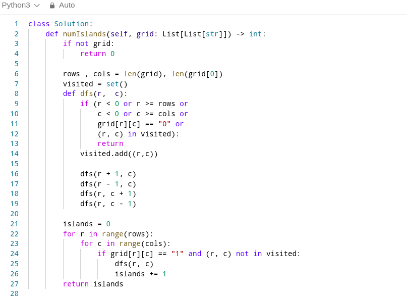
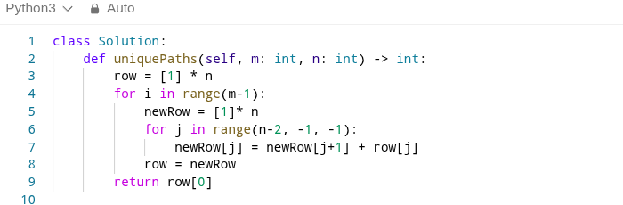
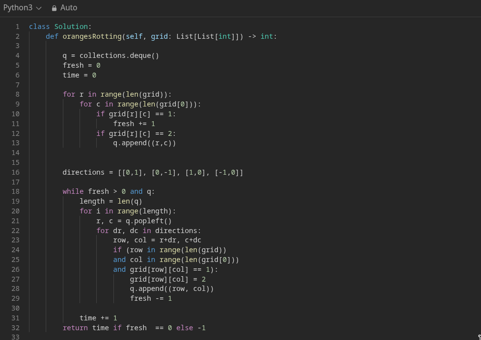

# **CODING INTERVIEW PREPARATION**

<!-- 🟢🟠🔴 ♻️	🔜	⏭️	❌🔄 -->

## Solved Problems
| Status | Level  | Problem | Solution Preview | Approach (Language) |
| ------ | ------ | ------- | ---------------- | ------------------- |
| ✅     | Easy   | [1. Two Sum](https://leetcode.com/problems/two-sum/) |  | Array (Python) |
| ✅     | Easy   | [2. Concatenation of Array](https://leetcode.com/problems/concatenation-of-array/) |  | Array (Python) |
| ✅     | Easy   | [3. Reverse String](https://leetcode.com/problems/reverse-string/) |  | String Manipulation (Python) |
| ✅     | Easy   | [4. Contains Duplicate](https://leetcode.com/problems/contains-duplicate/) |  | Hash Table (C++) |
| ✅     | Easy   | [5. Valid Palindrome](https://leetcode.com/problems/valid-palindrome/) |  | Two Pointers (Python) |
| ✅     | Easy   | [6. Best Time to Buy and Sell Stock](https://leetcode.com/problems/best-time-to-buy-and-sell-stock/) |  | Dynamic Programming (Python) |
| ✅     | Easy   | [7. Valid Parentheses](https://leetcode.com/problems/valid-parentheses/) |  | Stack (Python) |
| ✅     | Easy   | [8. Binary Search](https://leetcode.com/problems/binary-search/) |  | Binary Search (Python) |
| ✅     | Easy   | [9. Reverse Linked List](https://leetcode.com/problems/reverse-linked-list/) |  | Linked List (Python) |
| ✅     | Easy   | [10. Invert Binary Tree](https://leetcode.com/problems/invert-binary-tree/) |  | Binary Tree (Python) |
| ✅     | Medium | [11. Top K Frequent Elements](https://leetcode.com/problems/top-k-frequent-elements/) |  | Heap/Hash Table (Python) |
| ✅     | Medium | [12. Two Sum II - Input Array Is Sorted](https://leetcode.com/problems/two-sum-ii-input-array-is-sorted/) |  | Binary Search (Python) |
| ✅     | Medium | [13. Longest Substring Without Repeating Characters](https://leetcode.com/problems/longest-substring-without-repeating-characters/) |  | Sliding Window (Python) |
| ✅     | Medium | [14. Min Stack](https://leetcode.com/problems/min-stack/) |  | Stack (Python) |
| ✅     | Medium | [15. Evaluate Reverse Polish Notation](https://leetcode.com/problems/evaluate-reverse-polish-notation/) |  | Stack (Python) |
| ✅     | Medium | [16. Search a 2D Matrix](https://leetcode.com/problems/search-a-2d-matrix/) |  | Binary Search (Python) |
| ✅     | Medium | [17. Reorder List](https://leetcode.com/problems/reorder-list/) |  | Linked List (Python) |
| ✅     | Medium | [18. Lowest Common Ancestor of a Binary Search Tree](https://leetcode.com/problems/lowest-common-ancestor-of-a-binary-search-tree/) |  | Binary Search Tree (Python) |
| ✅     | Medium | [19. Subsets](https://leetcode.com/problems/subsets/) |  | Backtracking (Python) |
| ✅     | Medium | [20. K Closest Points to Origin](https://leetcode.com/problems/k-closest-points-to-origin/) |  | Heap/Sorting (Python) |
| ✅     | Medium | [21. Number of Islands](https://leetcode.com/problems/number-of-islands/) |  | DFS (Python) |
| ✅     | Medium | [22. Sum of Two Integers](https://leetcode.com/problems/sum-of-two-integers/) |  | Bit Manipulation (Python) |
| ✅     | Medium   | [23. Maximum Subarray](https://leetcode.com/problems/maximum-subarray/) |  | Kadane's Algorithm (Python) |
| ✅     | Medium   | [24. Insert Interval](https://leetcode.com/problems/insert-interval/) |  | Greedy (Python) |
| ✅     | Medium   | [25. Rotate Image](https://leetcode.com/problems/rotate-image/) |  | Matrix Manipulation (Python) |
| ✅     | Easy   | [26. Climbing Stairs](https://leetcode.com/problems/climbing-stairs/) |  | Dynamic Programming (Python) |
| ✅     | Medium   | [27. Unique Paths](https://leetcode.com/problems/unique-paths/) |  | Dynamic Programming (Python) |
| ✅     | Easy   | [28. Min Cost Climbing Stairs](https://leetcode.com/problems/min-cost-climbing-stairs/) |  | Dynamic Programming (Python) |
| ✅     | Medium | [29. Longest Common Subsequence](https://leetcode.com/problems/longest-common-subsequence/) |  | Dynamic Programming (Python) |
| ✅     | Medium | [30. House Robber](https://leetcode.com/problems/house-robber/) |  | Dynamic Programming (Python) |
| ✅     | Medium | [31. Best Time to Buy and Sell Stock with Cooldown](https://leetcode.com/problems/best-time-to-buy-and-sell-stock-with-cooldown/) |  | Dynamic Programming (Python) |
| ✅     | Medium | [32. Max Area of Island](https://leetcode.com/problems/max-area-of-island/) |  | DFS (Python) |
| ✅     | Easy   | [33. Last Stone Weight](https://leetcode.com/problems/last-stone-weight/) |  | Heap (Python) |
| ✅     | Medium | [34. Kth Largest Element in an Array](https://leetcode.com/problems/kth-largest-element-in-an-array/) |  | Heap/Quickselect (Python) |
| ✅     | Medium | [35. Combination Sum](https://leetcode.com/problems/combination-sum/) |  | Backtracking (Python) |
| ✅     | Medium | [36. Combination Sum II](https://leetcode.com/problems/combination-sum-ii/) |  | Backtracking (Python) |
| ✅     | Medium | [37. Jump Game](https://leetcode.com/problems/jump-game/) |  | Greedy (Python) |
| ✅     | Hard   | [38. Jump Game II](https://leetcode.com/problems/jump-game-ii/) |  | Greedy (Python) |
| ✅     | Medium | [39. 3Sum](https://leetcode.com/problems/3sum/) |  | Two Pointers (Python) |
| ✅     | Medium | [40. Koko Eating Bananas](https://leetcode.com/problems/koko-eating-bananas/) |  | Binary Search (Python) |
| ✅     | Easy   | [41. Merge Two Sorted Lists](https://leetcode.com/problems/merge-two-sorted-lists/) |  | Linked List (Python) |
| ✅     | Easy   | [42. Linked List Cycle](https://leetcode.com/problems/linked-list-cycle/) |  | Linked List (Python) |
| ✅     | Medium | [43. Binary Tree Level Order Traversal](https://leetcode.com/problems/binary-tree-level-order-traversal/) |  | Binary Tree (Python) |
| ✅     | Medium | [44. Binary Tree Right Side View](https://leetcode.com/problems/binary-tree-right-side-view/) |  | Binary Tree (Python) |
| ✅     | Easy   | [45. Maximum Depth of Binary Tree](https://leetcode.com/problems/maximum-depth-of-binary-tree/) |  | Binary Tree (Python) |
| ✅     | Medium | [46. Valid Sudoku](https://leetcode.com/problems/valid-sudoku/) |  | Hash Table (Python) |
| ✅     | Medium | [47. Longest Repeating Character Replacement](https://leetcode.com/problems/longest-repeating-character-replacement/) |  | Sliding Window (Python) |
| ✅     | Medium | [48. Daily Temperatures](https://leetcode.com/problems/daily-temperatures/) |  | Stack (Python) |
| ✅     | Medium | [49. Generate Parentheses](https://leetcode.com/problems/generate-parentheses/) |  | Backtracking (Python) |
| ✅     | Medium | [50. Remove Nth Node From End of List](https://leetcode.com/problems/remove-nth-node-from-end-of-list/) |  | Linked List (Python) |
| ✅     | Medium | [51. Copy List with Random Pointer](https://leetcode.com/problems/copy-list-with-random-pointer/) |  | Linked List (Python) |
| ✅     | Medium | [52. Permutations](https://leetcode.com/problems/permutations/) |  | Backtracking (Python) |
| ✅     | Medium | [53. Count Good Nodes in Binary Tree](https://leetcode.com/problems/count-good-nodes-in-binary-tree/) |  | Binary Tree (Python) |
| ✅     | Medium | [54. Clone Graph](https://leetcode.com/problems/clone-graph/) |  | Graph (Python) |
| ✅     | Medium | [55. Rotting Oranges](https://leetcode.com/problems/rotting-oranges/) |  | BFS (Python) |
| ✅     | Medium | [56. House Robber II](https://leetcode.com/problems/house-robber-ii/) |  | Dynamic Programming (Python) |
| ✅     | Medium | [57. Longest Palindromic Substring](https://leetcode.com/problems/longest-palindromic-substring/) |  | Dynamic Programming (Python) |
| ✅     | Medium | [58. Course Schedule](https://leetcode.com/problems/course-schedule/) |  | Graph (Python) |
| ✅     | Medium | [59. Gas Station](https://leetcode.com/problems/gas-station/) |  | Greedy (Python) |
| ✅     | Medium | [60. Hand of Straights](https://leetcode.com/problems/hand-of-straights/) |  | Greedy/minHeap (Python) |
| ✅     | Medium | [61. Find Minimum in Rotated Sorted Array](https://leetcode.com/problems/find-minimum-in-rotated-sorted-array/) |  | Binary Search (Python) |
| ✅     | Medium | [62. Add Two Numbers](https://leetcode.com/problems/add-two-numbers/) |  | Linked List (Python) |
| ✅     | Medium | [63. Palindromic Substrings](https://leetcode.com/problems/palindromic-substrings/) |  | Expand Around Center (Python) |
| ✅     | Medium | [64. Decode Ways](https://leetcode.com/problems/decode-ways/) |  | Recursion (Python) |
| ✅     | Medium | [65. Non-overlapping Intervals](https://leetcode.com/problems/non-overlapping-intervals/) |  | Greedy/Sorting (Python) |
| ✅     | Medium | [66. Spiral Matrix](https://leetcode.com/problems/spiral-matrix/) |  | Matrix Traversal (Python) |
---
